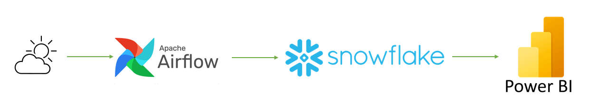
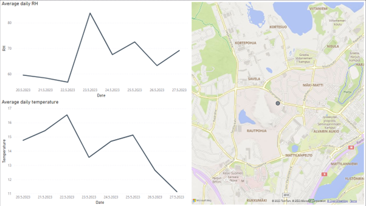
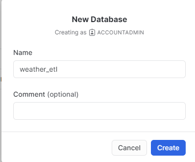
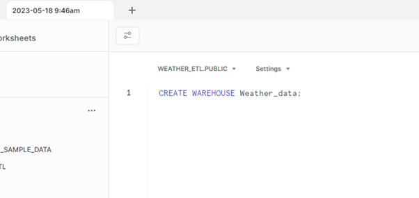
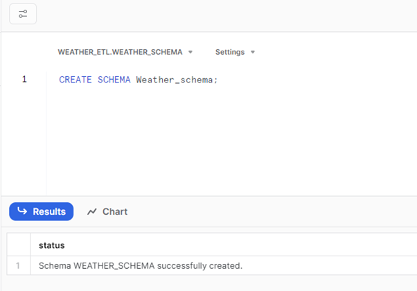
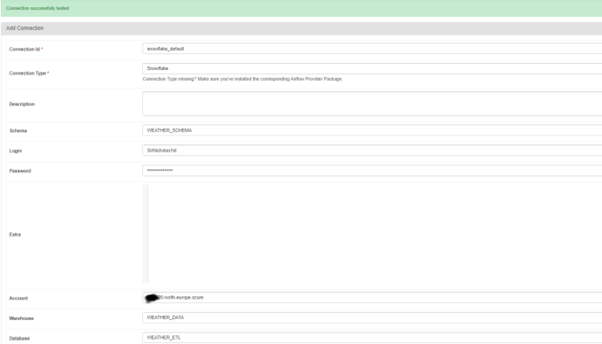
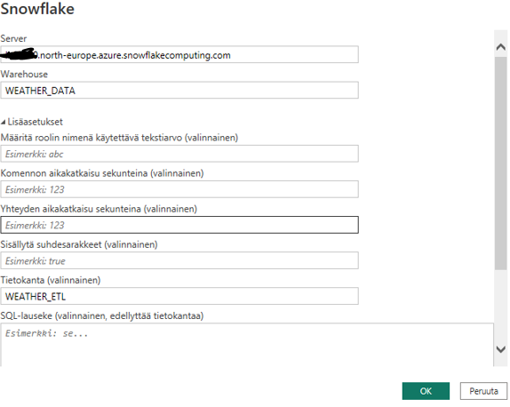

# Weather data to a Power BI dashboard

# 1. Project Overview

This project focuses on gathering weather data for Jyväskylä using the Open Meteo API and utilizing Apache Airflow, Snowflake, and Power BI to create a simple dashboard from the data.

By leveraging the Open Meteo API, the project retrieves up-to-date weather information for Jyväskylä. Apache Airflow is employed to automate the extraction and transformation of this data, ensuring a continuous and reliable pipeline.

The weather data is then stored and managed in Snowflake, a powerful cloud-based data warehouse. And lastly Power Bi is used to visualize the data.

The outcome was a simple dashboard containing the daily average temperature and average relative humidity and a map view based on the latitude and longitude.

# 2. Retrieving the data from the API

The data source for this project is an API that provides weather forecasts. The API offers the following features:

* End point ***'/v1/forecast'***
* Parameters 
    * ***'latitude'*** & ***'longitude'***:  Geographical coordinates of the location (required).
    * ***'elevation'***: Elevation used for statistical downscaling (optional).
    * ***'hourly'***: List of weather variables to be returned (optional).
    * ***'daily'***: List of daily weather variable aggregations to be returned (optional).
    * ***'current_weather'***: Flag to include current weather conditions in the output (optional).
    * Other parameters such as temperature unit, windspeed unit, time format, timezone, etc. (optional).

## 2.1 Integration
\
The integration with the API involves making HTTP requests to the ***'/v1/forecast'*** endpoint, passing the necessary parameters, and retrieving the JSON response containing the weather forecast data.

The API documentation (https://open-meteo.com/en/docs) provides detailed information about the available parameters, valid values, and the structure of the JSON response. By leveraging the API's capabilities, we can retrieve accurate and up-to-date weather forecasts for a given location.

# 3. Snowflake integration

The Integration to Snowflake begins from creating the necessary database, warehouse and schema for the project in Snowflake:

After creating the database select the worksheets section from Snowflake. The warehouse and schema can be created via SQL statements, make sure that the correct database has been selected:

To set up the connection with Airflow and Snowflake we will head to the Airflow Web GUI "Admin" and select "Connections"

From there select "Add a new connection" and fill the details:

Explanation of the required fields:
* **Connection id**: This will be referenced in the DAGS
* **Connection type**: Select the correct connection type, in this case Snowflake
* **Schema**: The schema we created for the project
* **Login** & **Password**: Your Snowflake Login and Password
* **Account**: Your Snowflake account identifier. If you encounter errors like *"250001: 250001: could not connect to snowflake backend after 0 attempt(s).aborting"* or the testing of the connection seems to be stuck and after a while it just gives a empty error message. It is most likely that there is a problem with the given Account format. In my case the identifier consists of account locator region and cloud. But these differ from region to region. More information can be found from here: https://docs.snowflake.com/en/user-guide/admin-account-identifier

# 4. Power BI Integration

The integration from Snowflake is quite straight forward since there are native connectors between them.

The steps are the following:

* From the top panel, choose "Get data" and from there "More..."
* Search and select Snowflake
* Input the required information

* Hit "ok" and sign in with your Snowflake user.

Now the connection between PowerBi and Snowflake is established and you can use the data from your tables to create reports.

# Conclusion 

In conclusion, the main focus of the project was to learn how to integrate Apache Airflow with various service providers. This involved understanding the concepts of Apache Airflow, exploring different service providers' APIs, and implementing the necessary connections to enable seamless integration.

Future improvement ideas could include retrieving data for more than one city and modifying the dashboard in a way that the user could select the city for which they would want to display the weather information.